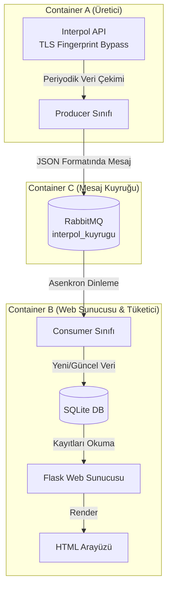

# Interpol Kırmızı Bülten Canlı Takip Sistemi (Python Developer Task)

Bu proje, Interpol tarafından yayınlanan güncel Kırmızı Bülten (Red Notice) arananlar verisini belirli periyotlarla çeken, bu veriyi RabbitMQ mesaj kuyruğu üzerinden asenkron olarak işleyen ve bir web arayüzünde canlı olarak sunan mikroservis tabanlı bir sistemdir.

## 🏗️ Proje Mimarisi

Sistem, bağımsız olarak çalışan ve Docker-Compose ile orkestre edilen 3 ana bileşenden (Container) oluşmaktadır.

Bileşenlerin Görevleri:
Container A (Producer): curl_cffi kütüphanesi kullanılarak Interpol API'sinin TLS Fingerprinting (Bot Koruması) engelleri aşılır. Belirlenen saniye periyotlarıyla güncel veri çekilir ve RabbitMQ'ya gönderilir. Nesne Yönelimli Programlama (OOP) prensiplerine uygun olarak tasarlanmıştır.

Container C (RabbitMQ): Üretici ve Tüketici arasındaki asenkron veri akışını sağlar. Mesaj kayıplarını önlemek için kuyruk yapısı kalıcı (durable=True) olarak yapılandırılmıştır.

Container B (Consumer & Web): Arka planda (Thread) RabbitMQ'yu dinleyerek gelen verileri SQLite veritabanına kaydeder. Arayüzde veri güncellemesi olduğunda alarm durumu oluşturur ve Flask üzerinden kullanıcıya sunar.

🚀 Teknolojiler
Dil: Python 3.10

Mesaj Kuyruğu: RabbitMQ (3-Management)

Web Çerçevesi: Flask

Veritabanı: SQLite

Güvenlik / Scraping: curl_cffi (Cloudflare & Akamai TLS Bypass)

Orkestrasyon: Docker & Docker-Compose

⚙️ Çevresel Değişkenler (Environment Variables)
Sistem, koda müdahale etmeden docker-compose.yml üzerinden yönetilebilir yapıdadır:

INTERPOL_URL: İstek atılacak API adresi.

RABBITMQ_HOST: RabbitMQ sunucu adresi (Docker içi: rabbitmq).

RABBITMQ_QUEUE: Kullanılacak kuyruk adı (Örn: interpol_kuyrugu).

PERIYOT_SANIYESI: Container A'nın veriyi kaç saniyede bir çekeceği.

WEB_PORT: Web arayüzünün çalışacağı port.

💻 Kurulum ve Çalıştırma
Proje tamamen Dockerize edilmiştir. Çalıştırmak için bilgisayarınızda Docker'ın kurulu olması yeterlidir.

1.Projeyi bilgisayarınıza klonlayın:
git clone [https://github.com/kullanici-adiniz/python-developer-task.git](https://github.com/kullanici-adiniz/python-developer-task.git)
cd python-developer-task

2.Docker-Compose ile tüm mimariyi ayağa kaldırın:
docker-compose up --build -d

3.Servislere erişin:

Web Arayüzü (Canlı Takip): http://localhost:5000

RabbitMQ Yönetim Paneli: http://localhost:15672 (Kullanıcı: guest, Şifre: guest)

🛑 Sistemi Durdurma
Sistemi kapatmak ve container'ları temizlemek için:
docker-compose down

Geliştirici: Buğra Kaan Kesmez

